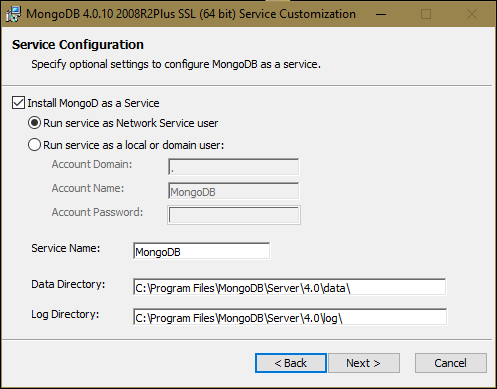

# Open4Tech 2019 - NetRom sessions

## REST in Node.JS at the React & Angular SPA

This repository contains the source code for the REST API and SPA applications presented by the NetRom Team during the Open4Tech 2019 event.

## REST API setup

For either running the application or building it from scratch, we need to make sure our environment is correctly setup.
To begin with, install the programs mentioned below, then follow the instructions to setup the Node REST API!

After reading this, you will have learned how to run a downloaded project and how to start one from ground up!

### Required software

- Node JS - [[download link]](https://nodejs.org/en/)
- MongoDB (choose MSI installer) - [[download link]](https://www.mongodb.com/download-center/community)

  **!!! Important !!!**

  Install MongoDB as a service to have it start up automatically, like in the picture below.

  

  Please make sure after installing the MongoDB server to create an empty directory tree at this path `C:/data/db`.
  This is required by MongoDB to save the database files and without it, the database server cannot startup.

- Postman - [[download link]](https://www.getpostman.com/)
- Visual Studio Code IDE - [[download link]](https://code.visualstudio.com/)
- Chrome web browser - [[download link]](https://www.google.com/chrome)

### Important packages

- Express - [[docs link]](https://expressjs.com/)
- Mongoose - [[docs link]](https://mongoosejs.com/)
- Babel - [[docs link]](https://babeljs.io/docs/en/usage)

### Run the project

Running a downloaded Node project involves a few easy steps, basically consisting of installing the dependencies (npm packages) and executing the main file (by running the `npm run start` command)

**Optional if you have not setup MongoDB to run as a service during the wizard**

- Open a command prompt from the Start menu
- Type `mongod` to start the MongoDB server

To run the code for this project:

- Open Visual Studio Code in the project folder
- Open a Command Line from the VS Code toolbar (Ctrl+Shift+`)
- Type `npm install` to automatically install all the required packages
- Wait for all packages to finish installing
- Type `npm run start` to start the REST API application
- Fire requests at `http://localhost:3000/api/...` endpoints (to see the defined routes check out the `./list/list.routes.js` and `./item/item.routes.js` files)!

### Build it from scratch

Creating a node project is simple and a summary of the steps we are going to take looks like this:

- Initialize the current folder as a Node project (`npm init`) so we can install packages from NPM to help us develop the API.
- Use a code monitor (`nodemon`) and a JS compiler/transpiler (`babel`) to have a better development experience.
- After setting up the environment (installing the IDE and having the packages installed), we are ready to code our app!
- Simply create your main file `index.js` and start the code monitor (`npm run start`) to get instant feedback in the command-line!

Now for the detailed explanations:

- Create a new folder and open VS Code with a terminal inside it
- Type `npm init` and follow the indications to setup the Node project (enter, enter, enter...)
- Update `package.json` scripts section to:
  ```
    ...
    "scripts": {
      "start": "nodemon --exec babel-node index.js"
    },
    ...
  ```
- Install the required packages with the following two commands:

  ```
  npm install --save express mongoose body-parser cors

  npm install --save-dev @babel/core @babel/cli @babel/preset-env @babel/node nodemon
  ```

- Create a new file `.babelrc` and paste in the following (taken from [babeljs.io](https://babeljs.io/docs/en/usage))

  ```
  {
    "presets": ["@babel/preset-env"]
  }
  ```

- Create a new file `index.js`
- Write your REST API! (start with the basic [Hello world! from express](https://expressjs.com/en/starter/hello-world.html))
- Run the code with `npm run start`
- Add the MongoDB connection and models using [mongoose](https://mongoosejs.com/docs/)
- Add the REST of the [express routes](https://expressjs.com/en/guide/routing.html)
- Congratulations, you've setup a new REST API!
